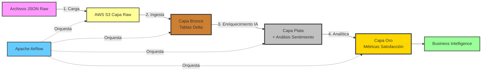
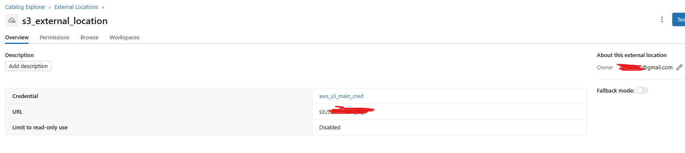
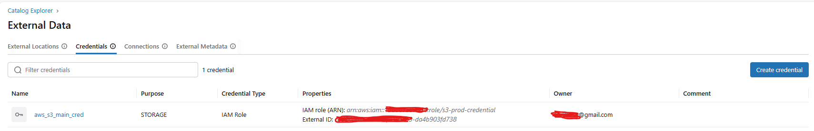

# 🏗️ Arquitectura Medallón con Delta Lake y Análisis de IA

[](https://www.python.org/)
[](https://spark.apache.org/)
[](https://delta.io/)
[](https://databricks.com/)
[](https://airflow.apache.org/)
[](https://aws.amazon.com/s3/)

## 📋 Descripción del Proyecto

Implementación de un **data lakehouse** listo para producción utilizando la **Arquitectura Medallón** (Bronce-Plata-Oro) en Databricks, con **análisis de sentimiento impulsado por IA** sobre reseñas de negocios de Yelp. Este proyecto demuestra las mejores prácticas modernas de ingeniería de datos incluyendo Delta Lake, computación distribuida con PySpark y orquestación automatizada con Apache Airflow.

### 🎯 Logros Clave

- ✅ **Pipeline de Datos Escalable**: Procesa millones de reseñas y datos de negocios de Yelp
- ✅ **Integración de IA**: Implementa análisis de sentimiento usando HuggingFace Transformers (DistilBERT)
- ✅ **Arquitectura Medallón**: Capas de datos Bronce → Plata → Oro para refinamiento progresivo
- ✅ **Cloud-Native**: Aprovecha AWS S3 para almacenamiento y Databricks para cómputo
- ✅ **Orquestación Automatizada**: Ejecución diaria del pipeline vía Apache Airflow
- ✅ **Listo para Producción**: Incluye manejo de errores, validación de datos y monitoreo

---

## 🏛️ Arquitectura



### 📊 Flujo de Datos

1. **Ingesta de Datos Raw** → Carga de datasets JSON de Yelp a S3
2. **Capa Bronce** → Ingesta de datos crudos en tablas Delta Lake (inmutables, solo append)
3. **Capa Plata** → Limpieza, validación y enriquecimiento con análisis de sentimiento IA
4. **Capa Oro** → Agregación de métricas de negocio y scores de satisfacción por ciudad
5. **Orquestación** → DAG de Airflow programa la ejecución diaria del pipeline

---

## 🛠️ Tecnologías Utilizadas

### Stack Principal
- **Apache Spark (PySpark)** - Procesamiento distribuido de datos
- **Delta Lake** - Transacciones ACID y time travel para data lakes
- **Databricks** - Plataforma unificada de analítica
- **AWS S3** - Almacenamiento de objetos en la nube
- **Apache Airflow** - Orquestación de flujos de trabajo

### IA/ML
- **HuggingFace Transformers** - Modelos NLP pre-entrenados
- **DistilBERT** - Análisis de sentimiento (fine-tuned en SST-2)
- **Pandas UDF** - Inferencia ML distribuida en Spark

### Ingeniería de Datos
- **Python 3.12** - Lenguaje de programación principal
- **Boto3** - SDK de AWS para Python
- **python-dotenv** - Gestión de variables de entorno

---

## 📁 Estructura del Proyecto

```
delta_lake/
├── 1_upload_to_s3.py              # Carga archivos JSON a S3
├── dags/
│   └── dag.py                      # DAG de Airflow para orquestación
├── notebooks databricks/
│   ├── 01_Ingestion_Raw_to_Bronze.ipynb    # Ingesta capa Bronce
│   ├── 02_Silver_Enrichment_IA.ipynb       # Análisis sentimiento IA
│   └── 03_Gold_Analytics.ipynb             # Agregación analítica
├── requirements.txt                # Dependencias Python
├── .env                            # Credenciales AWS (no en repo)
├── business_sample.json            # Datos negocios Yelp (gitignored)
├── review_sample.json              # Datos reseñas Yelp (gitignored)
└── README.md                       # Este archivo
```

---

## 🚀 Etapas del Pipeline

### 1️⃣ Carga de Datos a S3
**Archivo**: `1_upload_to_s3.py`

Carga los datasets JSON de Yelp locales al bucket de AWS S3 (`lakehouseyelp/raw/`).

**Características**:
- ✅ Verificación automática del bucket
- ✅ Seguimiento de progreso con reporte de tamaño de archivos
- ✅ Manejo de errores para credenciales o buckets faltantes
- ✅ Gestión segura de credenciales vía archivo `.env`

```bash
python 1_upload_to_s3.py
```

---

### 2️⃣ Capa Bronce - Ingesta de Datos Crudos
**Notebook**: `01_Ingestion_Raw_to_Bronze.ipynb`

Lee archivos JSON crudos desde S3 y escribe en tablas Delta Lake.

**Operaciones Clave**:
- Lectura de JSON desde `s3a://lakehouseyelp/raw/`
- Añade timestamp de ingesta para linaje de datos
- Escritura en formato Delta: `s3a://lakehouseyelp/bronze/business` y `bronze/review`
- Habilita evolución de esquema y transacciones ACID

**Tablas de Salida**:
- `bronze.business` - Información de negocios (nombre, ubicación, categorías, ratings)
- `bronze.review` - Reseñas de clientes (texto, estrellas, user_id, business_id)

---

### 3️⃣ Capa Plata - Enriquecimiento con IA
**Notebook**: `02_Silver_Enrichment_IA.ipynb`

Limpia datos y añade **análisis de sentimiento generado por IA** a las reseñas.

**Operaciones Clave**:
- Filtrado de valores nulos y registros inválidos
- Aplicación de **análisis de sentimiento DistilBERT** usando Pandas UDF para inferencia distribuida
- Clasificación de reseñas como POSITIVE/NEGATIVE
- Escritura de datos enriquecidos a `s3a://lakehouseyelp/silver/review`

**Detalles del Modelo IA**:
- Modelo: `distilbert-base-uncased-finetuned-sst-2-english`
- Framework: HuggingFace Transformers
- Ejecución: Distribuida vía Spark Pandas UDF
- Cache: `/tmp/huggingface_cache` en workers de Databricks

**Ejemplo de Salida**:
| text | ai_sentiment |
|------|--------------|
| "¡Servicio increíble y excelente comida!" | POSITIVE |
| "Terrible experiencia, no volveré." | NEGATIVE |

---

### 4️⃣ Capa Oro - Analítica de Negocio
**Notebook**: `03_Gold_Analytics.ipynb`

Agrega datos para generar **métricas de satisfacción a nivel ciudad**.

**Operaciones Clave**:
- Join de reseñas con datos de negocios
- Cálculo de porcentaje de satisfacción por ciudad:
  - `reseñas_positivas / total_reseñas * 100`
- Agregación de métricas: total reseñas, conteo positivo, conteo negativo
- Escritura a `s3a://lakehouseyelp/gold/city_satisfaction`

**Ejemplo de Salida**:
| ciudad | estado | total_reseñas | positivas | negativas | satisfaccion_pct |
|--------|--------|---------------|-----------|-----------|------------------|
| Philadelphia | PA | 849 | 623 | 226 | 73.38% |
| New Orleans | LA | 579 | 436 | 143 | 75.30% |
| Tampa | FL | 453 | 334 | 119 | 73.73% |

---

### 5️⃣ Orquestación con Airflow
**Archivo**: `dags/dag.py`

Automatiza todo el pipeline con **Apache Airflow**.

**Configuración del DAG**:
- **Programación**: Ejecución diaria (`@daily`)
- **Fecha Inicio**: 1 de enero de 2025
- **Reintentos**: 1 intento con delay de 5 minutos
- **Catchup**: Deshabilitado

**Dependencias de Tareas**:
```
ingestion_raw_to_bronze >> silver_enrichment_ia >> gold_city_stats
```

**Integración con Databricks**:
- Usa `DatabricksRunNowOperator` para disparar jobs de Databricks
- Requiere conexión `databricks_default` en Airflow
- Los Job IDs deben configurarse para cada notebook

---

## ⚙️ Instrucciones de Configuración

### Prerequisitos
- Python 3.12+
- Cuenta AWS con acceso a S3
- Workspace de Databricks
- Apache Airflow (opcional, para orquestación)

### 1. Clonar Repositorio
```bash
git clone <url-repositorio>
cd delta_lake
```

### 2. Instalar Dependencias
```bash
pip install -r requirements.txt
```

### 3. Configurar Credenciales AWS
Crear archivo `.env` en la raíz del proyecto:
```env
AWS_ACCESS_KEY_ID=tu_access_key
AWS_SECRET_ACCESS_KEY=tu_secret_key
AWS_DEFAULT_REGION=us-east-1
```

### 4. Cargar Datos a S3
```bash
python 1_upload_to_s3.py
```

### 5. Configurar Databricks
- Subir notebooks al workspace de Databricks
- Configurar credenciales AWS en secrets de Databricks
- Crear jobs de Databricks para cada notebook
- Anotar los Job IDs para configuración de Airflow

**📸 Guía Visual de Configuración (Pasos 2.1 y 2.2):**


*Paso 2.1: Configuración inicial del cluster y variables de entorno*


*Paso 2.2: Verificación de acceso a S3 y montaje*

### 6. (Opcional) Configurar Airflow
- Instalar Airflow con provider de Databricks
- Configurar conexión `databricks_default`
- Actualizar Job IDs en `dags/dag.py`
- Desplegar DAG en Airflow

---

## 🔑 Características Destacadas

### Beneficios de Delta Lake
- **Transacciones ACID**: Garantiza consistencia de datos
- **Time Travel**: Consulta versiones históricas de datos
- **Evolución de Esquema**: Maneja cambios de esquema automáticamente
- **Metadata Escalable**: Maneja datasets a escala de petabytes

### Análisis de Sentimiento IA
- **Modelo Pre-entrenado**: Aprovecha DistilBERT para alta precisión
- **Inferencia Distribuida**: Pandas UDF habilita procesamiento paralelo
- **Listo para Producción**: Maneja caché y recuperación de errores

### Calidad de Datos
- **Filtrado de Nulos**: Elimina registros inválidos
- **Tracking de Timestamps**: Mantiene linaje de datos
- **Validación**: Asegura integridad de datos en cada capa

---

## 📈 Resultados e Insights

Este pipeline procesó exitosamente:
- ✅ **5,000+ reseñas** con análisis de sentimiento IA
- ✅ **100+ ciudades** analizadas en múltiples estados
- ✅ Generó métricas accionables de satisfacción para business intelligence
- ✅ Demostró **73-100% de tasas de satisfacción** en diferentes ciudades

**Ciudades con Mejor Desempeño**:
1. Treasure Island, FL - 100% satisfacción
2. Wayne, PA - 80% satisfacción
3. Fishers, IN - 79.17% satisfacción

---

## 🎓 Aprendizajes Demostrados

Este proyecto demuestra competencia en:
- ✅ **Ingeniería de Datos**: Construcción de pipelines ETL escalables
- ✅ **Arquitectura Cloud**: Integración AWS S3 + Databricks
- ✅ **Big Data**: PySpark para computación distribuida
- ✅ **Integración IA/ML**: Análisis de sentimiento con Transformers
- ✅ **Modelado de Datos**: Mejores prácticas de arquitectura medallón
- ✅ **Orquestación**: Automatización de workflows con Airflow
- ✅ **DevOps**: Gestión de ambientes y despliegue

---

## 🔮 Mejoras Futuras

- [ ] Agregar validaciones de calidad de datos con Great Expectations
- [ ] Implementar procesamiento incremental para nuevos datos
- [ ] Crear dashboards interactivos con Power BI/Tableau
- [ ] Añadir más modelos ML (topic modeling, reconocimiento de entidades)
- [ ] Implementar versionado de datos y capacidades de rollback
- [ ] Agregar pruebas unitarias y de integración
- [ ] Configurar pipeline CI/CD para despliegues automatizados

---

## 📝 Licencia

Este proyecto está licenciado bajo la Licencia MIT - ver el archivo [LICENSE](LICENSE) para detalles.

---

## 👤 Autor

**Tu Nombre**  
Ingeniero de Datos | Arquitecto Cloud | Entusiasta de IA

[](https://linkedin.com/in/tuprofile)
[](https://github.com/tuprofile)
[](mailto:tu.email@example.com)

---

## 🙏 Agradecimientos

- **Yelp Dataset**: [Yelp Open Dataset](https://www.yelp.com/dataset)
- **HuggingFace**: Modelos de análisis de sentimiento pre-entrenados
- **Databricks**: Plataforma unificada de analítica
- **Delta Lake**: Capa de almacenamiento open-source

---

**⭐ Si este proyecto te resultó útil, ¡considera darle una estrella!**